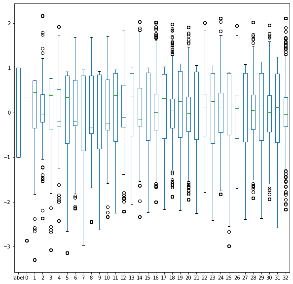
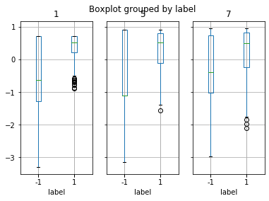
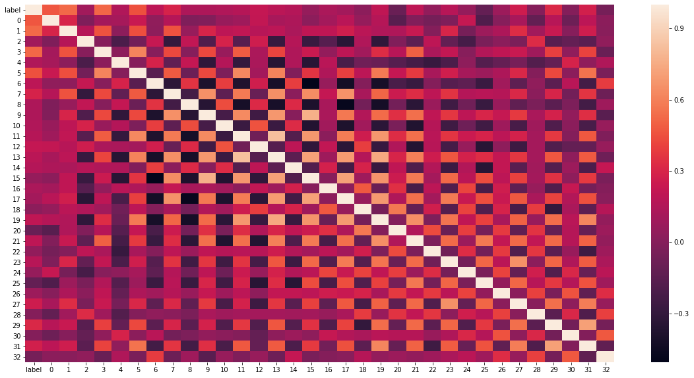
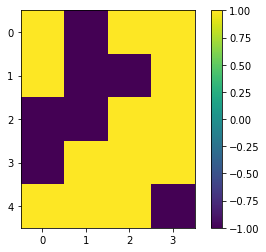

<h1> <center> Radial Basis Function Neural Network from Scratch </center> </h1>
Goal: Data classification <br/>
Using: Self Organizing Map and SOM's vectors in a Radial Basis Function Neural Network <br/> 
Author: BOUKHELOUA Rémi Tej


### Imports


```python
#Make sure you have all those packages available on your device
#If not you probably can do a conda install (Name of the package)
#For further details, please check: https://anaconda.org/conda-forge/repo

import scipy.io
import pandas as pd
import numpy as np
import seaborn as sns
import matplotlib.pyplot as plt
import math
import random
import csv
from collections import Counter
```

## Exploration


```python
dataTrainFile = "data_train" #Train data to load
labelTrainFile = "label_train" #Label of train data to load

dataTestFile = "data_test" #Train data to load
```


```python
# Loading data in lists
dataX = [list(i) for i in scipy.io.loadmat(dataTrainFile + ".mat")[dataTrainFile]]
dataY = [i[0] for i in list(scipy.io.loadmat(labelTrainFile + ".mat")[labelTrainFile])]
```


```python
#Charging datas in pandas dataframe for analysis only. Don't use pandas outside, it would slow down computations
df = pd.DataFrame(dataX, dataY).reset_index().rename(columns={"index": "label"})
```


```python
print("nb of line:", len(df))
print("nb of columns:", len(df.columns))
```

    nb of line: 330
    nb of columns: 34
    


```python
#Shape
df.head(3)
```


<div>
<style scoped>
    .dataframe tbody tr th:only-of-type {
        vertical-align: middle;
    }

    .dataframe tbody tr th {
        vertical-align: top;
    }

    .dataframe thead th {
        text-align: right;
    }
</style>
<table border="1" class="dataframe">
  <thead>
    <tr style="text-align: right;">
      <th></th>
      <th>label</th>
      <th>0</th>
      <th>1</th>
      <th>2</th>
      <th>3</th>
      <th>4</th>
      <th>5</th>
      <th>6</th>
      <th>7</th>
      <th>8</th>
      <th>...</th>
      <th>23</th>
      <th>24</th>
      <th>25</th>
      <th>26</th>
      <th>27</th>
      <th>28</th>
      <th>29</th>
      <th>30</th>
      <th>31</th>
      <th>32</th>
    </tr>
  </thead>
  <tbody>
    <tr>
      <th>0</th>
      <td>-1</td>
      <td>-2.865899</td>
      <td>0.720619</td>
      <td>2.164823</td>
      <td>-1.156208</td>
      <td>-0.251490</td>
      <td>-1.116596</td>
      <td>-0.229209</td>
      <td>-2.981564</td>
      <td>-2.441548</td>
      <td>...</td>
      <td>-0.684820</td>
      <td>0.139995</td>
      <td>0.887941</td>
      <td>-1.691672</td>
      <td>-2.393610</td>
      <td>2.023542</td>
      <td>-2.366672</td>
      <td>1.954525</td>
      <td>-2.581707</td>
      <td>2.104295</td>
    </tr>
    <tr>
      <th>1</th>
      <td>1</td>
      <td>0.347937</td>
      <td>0.641677</td>
      <td>0.060050</td>
      <td>0.767382</td>
      <td>-0.158263</td>
      <td>0.913227</td>
      <td>-0.050370</td>
      <td>0.768820</td>
      <td>-0.481110</td>
      <td>...</td>
      <td>0.277699</td>
      <td>-0.011530</td>
      <td>0.075298</td>
      <td>0.086337</td>
      <td>0.205240</td>
      <td>0.030311</td>
      <td>0.280999</td>
      <td>0.007095</td>
      <td>0.328369</td>
      <td>-0.034804</td>
    </tr>
    <tr>
      <th>2</th>
      <td>-1</td>
      <td>-2.865899</td>
      <td>-3.297799</td>
      <td>2.164823</td>
      <td>-1.156208</td>
      <td>-0.251490</td>
      <td>-1.116596</td>
      <td>-0.229209</td>
      <td>-2.981564</td>
      <td>1.691956</td>
      <td>...</td>
      <td>-2.413575</td>
      <td>-1.826594</td>
      <td>0.887941</td>
      <td>-1.691672</td>
      <td>1.079303</td>
      <td>2.023542</td>
      <td>-2.366672</td>
      <td>1.954525</td>
      <td>-0.668430</td>
      <td>-0.030918</td>
    </tr>
  </tbody>
</table>
<p>3 rows × 34 columns</p>
</div>


```python
#Proportion of -1 and 1
print("Repartition of labels")
df.groupby("label")[0].count()
```

    Repartition of labels
    
    label
    -1    116
     1    214
    Name: 0, dtype: int64


```python
#Box plot to see value ranges and repartition
df.boxplot(figsize = (10,10), grid = False)
```


    <matplotlib.axes._subplots.AxesSubplot at 0x9caf2b0>





```python
df.groupby("label").mean()
```


<div>
<style scoped>
    .dataframe tbody tr th:only-of-type {
        vertical-align: middle;
    }
    
    .dataframe tbody tr th {
        vertical-align: top;
    }

    .dataframe thead th {
        text-align: right;
    }
</style>
<table border="1" class="dataframe">
  <thead>
    <tr style="text-align: right;">
      <th></th>
      <th>0</th>
      <th>1</th>
      <th>2</th>
      <th>3</th>
      <th>4</th>
      <th>5</th>
      <th>6</th>
      <th>7</th>
      <th>8</th>
      <th>9</th>
      <th>...</th>
      <th>23</th>
      <th>24</th>
      <th>25</th>
      <th>26</th>
      <th>27</th>
      <th>28</th>
      <th>29</th>
      <th>30</th>
      <th>31</th>
      <th>32</th>
    </tr>
    <tr>
      <th>label</th>
      <th></th>
      <th></th>
      <th></th>
      <th></th>
      <th></th>
      <th></th>
      <th></th>
      <th></th>
      <th></th>
      <th></th>
      <th></th>
      <th></th>
      <th></th>
      <th></th>
      <th></th>
      <th></th>
      <th></th>
      <th></th>
      <th></th>
      <th></th>
      <th></th>
    </tr>
  </thead>
  <tbody>
    <tr>
      <th>-1</th>
      <td>-0.621755</td>
      <td>-0.736889</td>
      <td>-0.094129</td>
      <td>-0.712457</td>
      <td>-0.175886</td>
      <td>-0.633875</td>
      <td>-0.207343</td>
      <td>-0.412804</td>
      <td>-0.160251</td>
      <td>-0.193880</td>
      <td>...</td>
      <td>-0.236397</td>
      <td>-0.081370</td>
      <td>0.153250</td>
      <td>-0.102369</td>
      <td>-0.346642</td>
      <td>0.034486</td>
      <td>-0.437771</td>
      <td>0.01304</td>
      <td>-0.377915</td>
      <td>0.090371</td>
    </tr>
    <tr>
      <th>1</th>
      <td>0.347937</td>
      <td>0.374576</td>
      <td>0.106543</td>
      <td>0.371677</td>
      <td>0.135849</td>
      <td>0.314223</td>
      <td>0.188947</td>
      <td>0.195352</td>
      <td>0.123971</td>
      <td>0.097373</td>
      <td>...</td>
      <td>0.128322</td>
      <td>0.032896</td>
      <td>-0.089154</td>
      <td>0.059874</td>
      <td>0.189915</td>
      <td>0.027319</td>
      <td>0.219213</td>
      <td>0.00885</td>
      <td>0.192323</td>
      <td>-0.007589</td>
    </tr>
  </tbody>
</table>
<p>2 rows × 33 columns</p>
</div>


```python
#Getting boxplot to compare the two groups on a column
df.boxplot(by = "label", column=[1,5,7], layout = (1,3))
```


    array([<matplotlib.axes._subplots.AxesSubplot object at 0x000000001215D9B0>,
           <matplotlib.axes._subplots.AxesSubplot object at 0x000000001217CB38>,
           <matplotlib.axes._subplots.AxesSubplot object at 0x00000000121ABDD8>],
          dtype=object)





```python
#Correlation between columns
fig, ax = plt.subplots(figsize=(20,10))
sns.heatmap(df.corr())
```


    <matplotlib.axes._subplots.AxesSubplot at 0xb1765f8>





## Self Organizing Map Neural Network (FS)


```python
#Regular functions to calculate distances, find closest node ...

#Euclidian distance
def eucDist(v1, v2):
    return np.linalg.norm(v1 - v2) 

#Manhattan distance between 2D vectors (x1,y1) and (x2,y2)
def manhattanDist(x1, y1, x2, y2):
    return np.abs(x1-x2) + np.abs(y1-y2)

#Given a data (one row), returns the closest node in the Map (lowest euclidian distance)
def closestNode(data, map, mRows, mCols):
    # (row,col) of map node closest to data[t]
    result = (0,0)
    smallDist = 1.0e20
    for i in range(mRows):
        for j in range(mCols):
            ed = eucDist(map[i][j], data)
            if ed < smallDist:
                smallDist = ed
                result = (i, j)
    return result

#Returns most common value in a list
def mostCommon(lst):
    if len(lst) == 0: return -2
    return Counter(lst).most_common(1)[0][0]
```


```python
# Variables set up
np.random.seed(1) #Set seed to fix the random value generation (random but every time is the same sequence)
Dim = 33 #Nb of columns in data
Rows = 5; Cols = 4  #Dimmension of SOM
RangeMax = Rows + Cols #Maximum manhattan distance between two neurons
LearnMax = 0.1 #Initial learning rate
StepsMax = 5000 #Maximum nb of step
```

### Train


```python
#Trainsing the SOM Network
somNetwork = np.random.random_sample(size=(Rows,Cols,Dim)) #Centers
for s in range(StepsMax):
    if s % (StepsMax/10) == 0: print("step = ", str(s))
    pctLeft = 1.0 - ((s * 1.0) / StepsMax) #Small Pourcentage to make variables decrease depending on the amount of steps already done
    currRange = (int)(pctLeft * RangeMax) #Max distance between a neuron to update and the winner of the round
    currRate = pctLeft * LearnMax #Importance of the modification
    t = np.random.randint(len(dataX)) #Draw random element in data
    #1. Competition
    (bmuRow, bmuCol) = closestNode(dataX[t], somNetwork, Rows, Cols) #Find the winner
    #Update all neurons that are close enough to the winner
    for i in range(Rows):
        for j in range(Cols):
            if manhattanDist(bmuRow, bmuCol, i, j) < currRange: #2. Cooperation
                somNetwork[i][j] = somNetwork[i][j] + currRate * (dataX[t] - somNetwork[i][j]) #3. Adaptation

                
print("SOM construction complete \n")
```

    step =  0
    step =  500
    step =  1000
    step =  1500
    step =  2000
    step =  2500
    step =  3000
    step =  3500
    step =  4000
    step =  4500
    SOM construction complete 
    


### Associating neurons to the cluster they mostly give


```python
# Associate each data label with a map node (closest one)
mapping = np.empty(shape=(Rows,Cols), dtype=object)

for i in range(Rows):
    for j in range(Cols):
        mapping[i][j] = []
        
sigma = [0 for i in range(Rows * Cols)] #Will be the mean of distances of every point related to a center (used in RBF)

#Associate to each data the closest node
for t in range(len(dataX)):
    (mRow, mCol) = closestNode(dataX[t], somNetwork, Rows, Cols)
    sigma[mRow*Cols + mCol] += eucDist(dataX[t], somNetwork[mRow][mCol]) #Adding the distance
    mapping[mRow][mCol].append(dataY[t]) #Association

#Knowing the class a node is the most related to
labelMap = np.zeros(shape=(Rows,Cols), dtype=np.int) #Most commun label of data associated to a node
for i in range(Rows):
    for j in range(Cols):
        labelMap[i][j] = mostCommon(mapping[i][j])

#Show on a map the repartition
plt.imshow(labelMap)
plt.colorbar()
plt.show()


```





```python
#Knowing how much data points are related to each neuron
countMap = np.zeros(shape=(Rows,Cols), dtype=np.int) 
for i in range(Rows):
    for j in range(Cols):
        tmp = 0
        label = labelMap[i][j]
        for k in mapping[i][j]:
            tmp += 1 if k == label else 0
        countMap[i][j] = tmp
```


```python
#Need to check if every neurons has been the winner once
#Othewise, when I calculate sigma, I would divid by nb of closest point (0) and generate error
print("Closest once:", len(np.argwhere(countMap > 0)))
print("Never closest:", Cols * Rows - len(np.argwhere(countMap > 0)))
```

    Closest once: 20
    Never closest: 0
    

## Radial Basis Function Neural Network (FS)


```python
#Basic Functions recquired for construction of the RBF

def gaussianFunction(d, sigma):
    return math.exp(- d ** 2 / (2 * sigma ** 2))

#inverse matrix m
def inverseMatrix(m):
    return np.matrix(m).I.A

#Transpose matrix m
def transposeMatrix(m):
    return np.matrix(m).T.A

#Giving a row, centers and weights, it returns the predicted value (any range, surely in ]-infinite;+infinite[)
def predict(x, c, weights):
    tmp = 0
    tmpO = []
    #Calculating every output o
    for i in range(len(c)):
        tmpO.append(gaussianFunction(eucDist(x, c[i]),sigma[i]))
    tmpO.append(1)
    return (tmpO * np.matrix(weights).T).A[0][0] #f = o * transposed(w)

#Calculate least square error between result and labels
def leastSquare(result, labels):
    tmp = 0
    for x in range(len(result)):
        tmp += (result[x] - labels[x]) ** 2
    return tmp / (len(result)*2)

#Calculate classification accuracy:
#TP = True Positive, TN = True Negative, FP = False Positive, FN = False Negative
#Accuracy = (TP + TN) / (TP + TN + FP + FN)
def accuracy(predicted, reality):
    cpt = 0
    for i in range(len(predicted)):
        if predicted[i] == reality[i]: cpt += 1
    return cpt/len(predicted)
```


```python
# Variable set up

#Flat it as we want one layer and not  a 2D list (grid)
c = [somNetwork[i][j] for i in range(len(somNetwork)) for j in range(len(somNetwork[i]))] 

#Tried different distances
distanceToUse = "Euclidian" 

```


```python
#Having a SIGMA per variables to have larger/smaller zones covered by a center
for i in range(len(countMap)):
    for j in range(len(countMap[i])):
        if countMap[i][j] != 0:
            sigma[i*Cols + j] = sigma[i*Cols + j]/countMap[i][j] #Divide the sum of distance to the point by the nb of points

#Deleting the centers that have a sigma equals to 0
#That means they don't have any points related and that would be unrelevant to have vectors not representatives of the datas
cpt = 0
for i in range(len(sigma)):
    if sigma[i-cpt] == 0:
        sigma.pop(i - cpt)
        c.pop(i - cpt)
        cpt += 1
        
sizeHidden = len(c)
```


```python
#Set train test dataset
#We separate them to have fresh data to choose the threshold to state what is -1 and what is 1
#As the dataset is pretty small (330 lines only), we will still use the training data for thresh determination
#Stating on a 66 population might not be the best choice
trainPart = 0.8

dataIndex = [i for i in range(len(dataX))]
shuffledIndex = random.sample(dataIndex, len(dataIndex)) #Randomize Indexes

#Train Set
trainSetX = []
trainSetY = []
for i in shuffledIndex[:int(trainPart * len(dataX))]:
    trainSetX.append(dataX[i])
    trainSetY.append(dataY[i])

#Test Set
testSetX = []
testSetY = []
for i in shuffledIndex[int(trainPart * len(dataX)):]:
    testSetX.append(dataX[i])
    testSetY.append(dataY[i])

```

### Train: Weights calculation


```python
#Calculation of o for each data in train set
o = np.zeros(shape=(len(trainSetX), sizeHidden + 1)) 
for i in range(len(trainSetX)):
    for j in range(sizeHidden):
        if distanceToUse == "Euclidian":
            o[i][j] = gaussianFunction(eucDist(trainSetX[i], c[j]),sigma[j])
    o[i][sizeHidden] = 1

```


```python
#Calculation of all weights minimizing to least square cost function 
weights = np.dot( 
    inverseMatrix( np.dot(transposeMatrix(o) , o) ),
    np.dot( transposeMatrix(o) , trainSetY )
)
```

### Threshold selection and Test


```python
resultTrain = []
for i in trainSetX:
    resultTrain.append( predict(i, c, weights))
```


```python
#Calculate maximal accuracy and corresponding threshold on TEST SET ONLY
resultTest = []
for i in testSetX:
    resultTest.append( predict(i, c, weights))

accuracyTest = 0
threshTest = 0
for i in range(-1000,1000):
    r = [-1 if e < i/1000 else 1 for e in resultTest]
    tmp = accuracy(r, testSetY)
    if tmp > accuracyTest:
        accuracyTest = tmp
        threshTest = i/1000

print("Accuracy on test data:", accuracyTest, "with a thresh of:", threshTest)
```

    Accuracy on test data: 0.9848484848484849 with a thresh of: -0.217
    


```python
#Calculate maximal accuracy and corresponding threshold the whole dataset
resultO = []
for i in dataX:
    resultO.append( predict(i, c, weights))

accuracyOverall = 0
threshOverall = 0
for i in range(-1000,1000):
    r = [-1 if e < i/1000 else 1 for e in resultO]
    tmp = accuracy(r, dataY)
    if tmp > accuracyOverall:
        accuracyOverall = tmp
        threshOverall = i/1000

print("Accuracy on all data:", accuracyOverall, "with a thresh of:", threshOverall)
```

    Accuracy on all data: 0.9575757575757575 with a thresh of: -0.119
    


```python
print("Final results with the overall threshold (" + str(threshOverall) + "): ")
print(" - Accuracy on train data:", accuracy([-1 if e < threshOverall else 1 for e in resultTrain], trainSetY) *100)
print(" - Accuracy on test data: ", accuracy([-1 if e < threshOverall else 1 for e in resultTest], testSetY)*100)
print(" - Accuracy on all data:  ", accuracy([-1 if e < threshOverall else 1 for e in resultO],dataY)*100)
```

    Final results with the overall threshold (-0.119): 
     - Accuracy on train data: 95.45454545454545
     - Accuracy on test data:  96.96969696969697
     - Accuracy on all data:   95.75757575757575
    

## Prediction


```python
#Predict on the dataset provided as "Test Set" with threshold previously selected
dataToPredictX = [list(i) for i in scipy.io.loadmat(dataTestFile + ".mat")[dataTestFile]] 
#[list(i) for i in np.loadtxt(dataTestFile, delimiter=",", dtype=np.float64)]
prediction = []
for i in dataToPredictX:
    prediction.append( -1 if predict(i, c, weights) < threshOverall else 1 )

prediction
```


    [1, -1, 1, -1, 1, -1, 1, -1, 1, -1, 1, -1, 1, 1, 1, -1, 1, -1, 1, -1, 1]


```python
#Write results in a csv
with open("prediction.csv", 'w', newline='') as file:
    writer = csv.writer(file)
    for i in zip(prediction):
        writer.writerow(i)
```

## To try / To go further
 - Bottom up/Top down ?
     - Train bigger SOM?
     - Building up to optimal one?
     
## From .mat to .csv

```python
#Code I used to transform the data from matlab format to csv one, so I don't need to do it every time

# import scipy.io
# import numpy as np

# dataX = scipy.io.loadmat(r"data_train.mat")
# np.savetxt("data_train.csv", np.asarray(dataX["data_train"]), delimiter=",")
# dataY = scipy.io.loadmat(r"label_train.mat")
# np.savetxt("label_train.csv", np.asarray(dataY["label_train"]), delimiter=",")
# dataToPredictX = scipy.io.loadmat(r"data_test.mat")
# np.savetxt("data_test.csv", np.asarray(dataToPredictX["data_test"]), delimiter=",")
```
